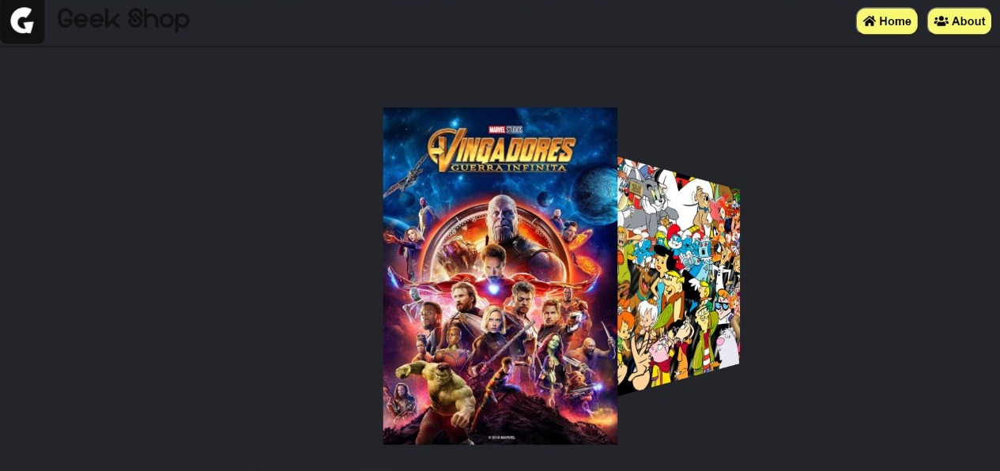
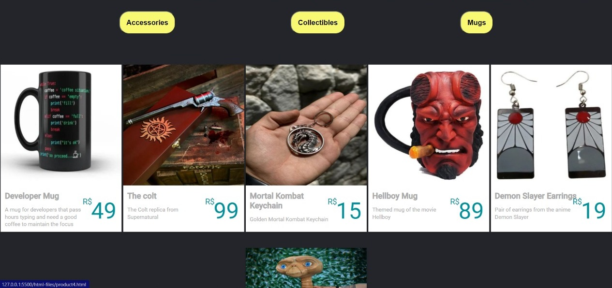
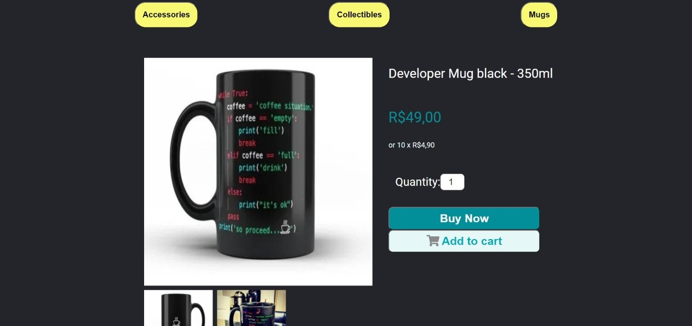
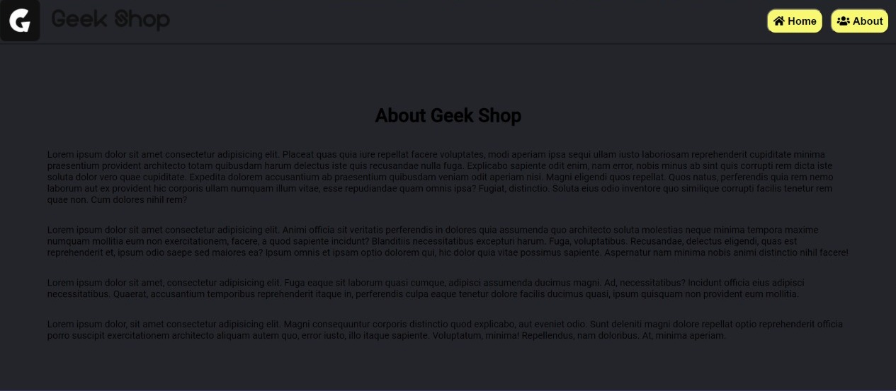
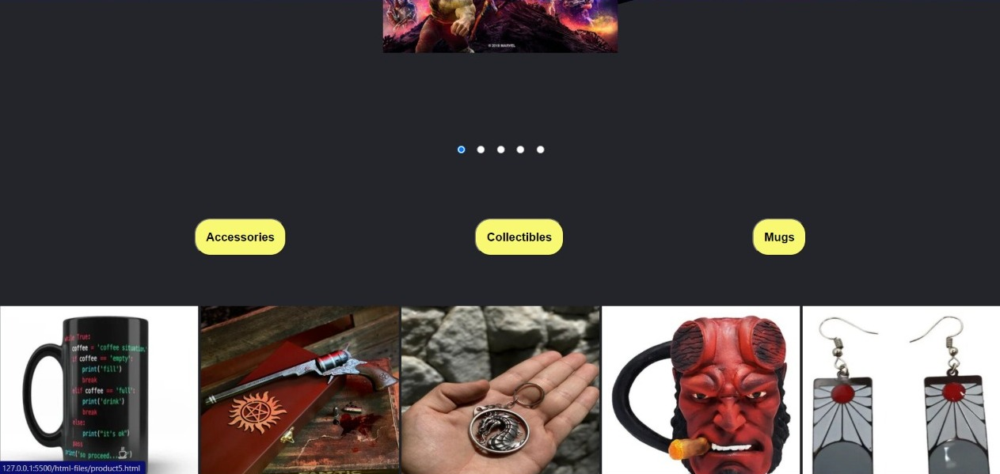
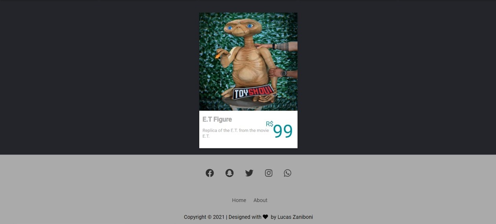

<h1 align= center>GEEK SHOP Project</h1>

<h4 align= center>Project with the intention of learning the fundamentals and functionalities of HTML and CSS</h4>

About
-------------------

#### This project was carried out as the 1st HTML and CSS challenge of the Full Stack Development training course at Gama Academy. As a proposal, I created a hardware parts store with pure HTML and CSS, putting all the knowledge acquired in a 2 week course.

languages
-------------------
- HTML5
- CSS3

-------------------
### **Devices**
- The site works on all devices with screen dimensions of 1280, 1024 and 375px
-------------------
### **Project Status**:
The project is finished and has the following features:
 - Home page with 6 product varieties and a carousel showing theme images of the store's products
 -  Menu with home page buttons and institutional page

-------------------
 - Exclusive page for each product with price, purchase options, product details and technical specifications

-------------------
 - Institutional page with information about the company

-------------------
 - Filter pages by product department

-------------------
 - Footer with copyright and icons linked to social networks that light up the logo color when hovering over it with the mouse

-------------------
 Responsiveness for all devices

### **Site developed by:**
- Lucas Dantas Zaniboni
